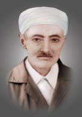

+++
title = "Bediüzzaman Hazretleri’nin Hayru’l-Halefi"
image = 'afyon-hapsi-mahkemeye-goturulurken.jpg'
toc = true
tags = [
    "Bediüzzaman",
    "Hayrul-halef",
    "Nur kahramanı",
    "Risale-i Nur"
]
categories = [
    "Bediüzzaman'ın Halefi"
]
weight = 100
audioSrc = "/audio/bediuzzaman-hayrul-halefi.mp3"
+++

>Risale-i Nur ‘da Hüsrev Efendi’nin ileride Bediüzzaman Hazretleri’nin davasını devam ettirecek hayru’l-halefi olduğunu gösteren yerleri bir arada sunuyoruz. 


# Risale-i Nur’dan Hüsrev Efendi’ye İşaret Eden Bahisler

<figure style="float:left; width: 147px;">
  
  <figcaption>
      
Ahmed Hüsrev Altınbaşak

      
(1899 – 1977)

  </figcaption>
</figure>

Isparta Talebelerinin Nur Hizmeti’ne sahip çıkmalarının ardından, Hulusi, 
Hâfız Ali, Hoca Sabri gibi pek çok kahraman ve sadık Nur Talebeleri yetişmişti.
Bediüzzaman’ın saff-ı evvel adını vererek övdüğü bu ilk dönem talebeleri içinde
Hüsrev Efendi’nin, Nur Hizmeti’nde gösterdiği olağanüstü faaliyeti çok geçmeden
onu talebeler içinde öne çıkarmıştı. Bu sebeble Bediüzzaman Hazretleri onun 
fevkalâde sadakatini, ihlâsını, dirayetini, çalışkanlığını ifade eden pek çok 
satırlar kaleme alarak Risale-i Nur’a kaydetmişti. Daha önce ilgili kısımlarda 
bahsi geçen ve Hüsrev Efendi’nin ileride Bediüzzaman Hazretleri’nin davasını devam 
ettirecek <b>hayru’l-halefi</b> 
<a name="source_1" href="#ref_1"> [1] </a>
olmaya liyakatini gösterip onun bu müstakbel
vazifesine işaret eden satırları makam münasebetiyle burada tekrar bir arada sunuyoruz. 
Bu ifadeleri biraz dikkatle okuyan kimse, Bediüzzaman’dan sonra Hüsrev Efendi’nin Nur 
cemaatinin sevk ve idaresinde vazifeli olduğuna ve buna en layık talebesi olduğuna kanaat sahibi olacaktır.

Mesela Şuâlar Mecmuası’nda yer alan ve Nur Talebeleri’ne hitaben yazdığı şu satırlarda, Bediüzzaman Hazretleri, 
Hüsrev Efendi’yi gayet açık bir şekilde kendi yerinde göstermektedir:

“Hüsrev gibi bir Nur kahramanından –benim yerimde 
ve Nur’un şahs-ı mânevîsinin (manevi şahsiyetinin) çok ehemmiyetli 
bir mümessili (temsilcisi) olmasından-  hiç bir cihetle gücenmemek elzemdir
 (çok lâzımdır)” <a name="source_2" href="#ref_2"> [2] </a> 

Risale-i Nur’da yer alan diğer bazı mühim ifadeler ise şöyledir:

> “Ecel gizli olmasından, vasiyetnâme yazmak sünnettir. 
Benim metrukâtım (arkamda bıraktıklarım) ve Risale-i Nur’dan olan benim hususi kitablarım ve güzel cildlenmiş 
mecmualarım vesair şeylerimin bütününü, Gül ve Nur Fabrikaları’nın heyetine, ** başta Hüsrev ** ve
 Tâhirî olarak o heyetten on iki kahraman kardeşlerime vasiyet ediyorum.” 
<a name="source_3" href="#ref_3"> [3] </a>

>**“Risale-i Nur’un kahramanı Hüsrev, benim bedelime ölmek ve benim yerimde hasta olmak samimi ve ciddi istiyor.** 
Ben de derim: Te’lif zamanı değil, şimdi neşir zamanıdır. 
Senin yazın, benim yazımdan ne derece ziyade ve neşre faideli ise,
** hayatın dahi Hizmet-i Nûriye’de benim bu azablı hayatımdan o derece faidelidir. ** **Eğer benim elimden gelseydi, hayatımdan ve sıhhatimden size memnuniyetle verirdim.”** 
<a name="source_4" href="#ref_4"> [4] </a>

>**“Hüsrev’in hakikaten** **tedbirce bana ihtiyaç bırakmayacak bir derecede tedbir ve dirayeti ** ve Hâfız Ali gibi yüksek ihlâsı ve mahviyeti…”**  <a name="source_5" href="#ref_5"> [5] </a>



>“Gizli düşmanlarımız **iki planı** takib ediyorlar. Biri beni ihanetlerle çürütmek; ikincisi, mabeynimize bir soğukluk vermektir. 
** Başta Hüsrev aleyhinde bir tenkid ve itiraz ve gücenmek ile bizi birbirimizden ayırmaktır. **
**Ben size ilan ederim ki; Hüsrev’in bin kusuru olsa ben onun aleyhinde bulunmaktan korkarım. 
Çünkü şimdi onun aleyhinde bulunmak, doğrudan doğruya  *Risale-i Nur aleyhinde ve benim aleyhimde ve bizi perişan edenlerin lehinde*  bir** **azim hıyanettir. **
<a name="source_6" href="#ref_6"> [6] </a>
<a name="source_7" href="#ref_7"> [7] </a>

>“Bilhassa Medresetüzzehrâ erkânlarının, **hususan Hüsrev’in** bu vatan ve millet ve Âlem-i İslâm’a hizmet-i imaniyeleri 
ve tahribçi dinsizlerin desiselerine sed çekmeleri o kadar büyük bir hasenedir ki, 
farz-ı muhal binler seyyie olsa afvettirir. Öyle ise, **başta Hüsrev** **olarak o erkânların** ** hiçbir hareketini tenkid etmemek**
**ve kemal-i ihlas ve samimiyet ile** ** onlara tesanüd ** **ve tam kardeş olmak lazımdır.”** <a name="source_8" href="#ref_8"> [8] </a>

>**“Hüsrev**, **Türk milletinin mânevî büyük bir kahramanı ve bu vatanın bir halaskarıdır   (kurtarıcısıdır) ve** 
**Türk milleti onun ile iftihar edecek**
**bir hâlis fedakârıdır**. **Ve** 
**sırr-ı ihlâsa tam mazhar olduğundan benlik ve riyakârlık ve şöhretperestlik bulunmaması** 
**cihetiyle çok hizmet-i vataniye ve milliyesinden bir ikisini beyan etmek zamanı geldi. Bu zat müstesna ve şirin
kalemiyle nurlardan altı yüz risaleye yakın yazmış ve vatanın her tarafına neşrederek komünist perdesi altında 
dehşetli ifsada çalışan** **anarşistliği kırdı ve tecavüzünü durdurdu**
**ve bu mübarek vatanı ve bu kahraman milleti o zehirden kurtarmak için tesirli tiryakları her tarafa yetiştirdi. Türk gençlerini ve nesl-i atiyi büyük bir tehlikeden kurtarmaya vesile oldu.”**<a name="source_9" href="#ref_9"> [9] </a>

>**“Hem bu Hüsrev’in kalemi gibi; fikri, kalbi de o nisbette harika diyebiliriz. Risale-i Nur’a karşı irtibatı ve iştiyakı ve kanaatı gittikçe terakki ve inkişaf ediyor.** **
Hiçbir hâdise onu sarsmıyor, fütur vermiyor.” **<a name="source_10" href="#ref_10"> [10] </a>

>**“Mübarek Hüsrev’in Risaletü’n-Nur hakkında** **
kerâmetli ve dikkatli ve isabetli ve keskin nazarı doğrudur.”**
<a name="source_11" href="#ref_11"> [11] </a>

>“(On Beşinci Şuâ’ın) Bundan sonraki kısmı, bütün ömrümde görmediğim dehşetli ve semli (zehirli) bir hastalık içinde yazılmış. Kusuratıma nazar-ı müsamaha ile bakılsın.**
Hüsrev, münasib görmediği kısmı ta’dil, tebdil, ıslah edebilir.” 
** <a name="source_12" href="#ref_12"> [12] </a>

>**“Risale-i Nur, Kur’ân’ın bir mucize-i mânevîsi olduğu gibi;** **
Hüsrev’in kalemi de, Risale-i Nur’un pek kuvvetli bir kerâmeti** 
**olduğunu buraca hergün tasdik ediyoruz.”**  <a name="source_13" href="#ref_13"> [13] </a>

>**“Gül ve Nur Fabrikası namına Hüsrev’in tebrik mektubu, beni sevinçle ağlattırdı. Zaten Hüsrev’in mümtaz bir hâsiyeti budur ki; şimdiye kadar bana gelen bütün** **
mektublarının hiçbirisi beni incitmiyor,
** elim zamanlarımda da yumuşak geliyor, ruhumu okşuyor. Bu cihette dahi ona şahsım itibariyle çok minnetdarım.” <a name="source_14" href="#ref_14"> [14] </a>

>**“Buranın bir Hüsrev’i** olacak derecede ihlas ve irtibat ve iktidarı gösteren…”<a name="source_15" href="#ref_15"> [15] </a>

>“Lillahilhamd sizlerin gayretinizle **o havalide çok Hüsrevler var,** meydana çıkmağa başlamışlar.” <a name="source_16" href="#ref_16"> [16] </a>

>“Isparta’nın Hâfız Ali’si (Kâtib Osman) **elhak ikinci bir Hüsrev** olduğuna benim de kanaatım geldi.” <a name="source_17" href="#ref_17"> [17] </a>

>**“Denizli’nin bir Hüsrev’i Hasan Feyzi’nin** uzunca, tafsilatlı bir mektubunu vasıtanızla aldım.” <a name="source_18" href="#ref_18"> [18] </a>

>**“Nazif ‘e** bin barekallah, bin mâşâallah. **İkinci bir Hüsrev,** İnebolu ikinci bir Isparta olduğunu ispat ediyor.”<a name="source_19" href="#ref_19"> [19] </a>

>“**Asr-ı saadetten beri böyle harika bir sûrette mucizeli olarak yazılmasına hiç kimse kadir olmadığı halde Risale-i Nur’un kahraman bir kâtibi olan** Hüsrev’e “Yaz” emri buyrulmasıyla, Levh-i Mahfuz’daki yazılan Kur’ân gibi yazılması…”<a name="source_20" href="#ref_20"> [20] </a>

>“Evet kardeşim, **…sizin gibi çarklardan mürekkeb olan bir cemaat-ı mübareke içinde** **
en has ve en yüksek mertebeye**
**kâtib tayin edildiğine  o rüya beşaret verdiği gibi, biz de beşaret ediyoruz.**” <a name="source_21" href="#ref_21"> [21] </a>

# Hüsrev Efendi’nin Risale-i Nur’da Yer Alan Beyanlarından

>“Her tarafı ve her hali kusur ve ayıbla dolu talebeniz, **sevgili Üstad’ının ayaklarının altına varlığını sermişti.** Belki her gün, bu şiddetten daha büyük bir şiddetle muamele görse ve hatta **
 Üstad’ı uğrunda, yüz bin hayatı olsa hepsini bile vermeye bila-tereddüd hazır olduğunu,** sûrî değil, kalbi bir itirafla müheyyâdır (hazırdır).” <a name="source_22" href="#ref_22"> [22] </a>

>**“Evet sevgili Üstad’ım, biz Allah’tan, Kur’ân’dan, Habib-i Zişan’dan ve Risale-i Nur’dan ve Kur’ân dellalı** **siz sevgili Üstad’ımızdan ebediyen razıyız. Ve intisabımızdan hiçbir cihetle pişmanlığımız yok.” **<a name="source_23" href="#ref_23"> [23] </a>

>**“Ben Üstad’ımın gittiği meslekte ve Risale-i Nur’la Âlem-i İslâm’a hususan bu vatana ve bu millete ettiği kudsi hizmetinde kendisine isnad edilen** **
mevhum suçuna ruh u canımla iştirak ediyorum.** 
**Ve beni bu hizmet-i imaniyede muvaffak eden Cenab-ı Hakk’a âhir ömrüme kadar şükredeceğim.”**  <a name="source_24" href="#ref_24"> [24] </a>

**Devamı:** [Hüsrev Efendi’nin Şifâhî Rivayetleri]()

























